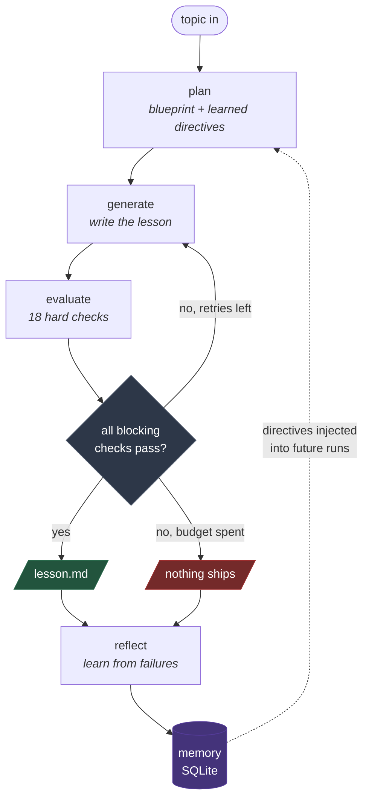
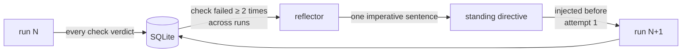

# lessonforge

**A self-evaluating lesson content generator.** It writes a beginner lesson,
judges its own work against a hard pass/fail rubric, and rewrites from the
failure reasons until the content clears the bar — or refuses to ship anything
at all.

The interesting part is not the lesson. It is that the system decides, on its
own, whether the lesson is good enough, and can prove that its judgement
discriminates.

> Built for the GenAI Engineer — Content Systems assessment.
> Topic: **Introduction to RAG (Retrieval-Augmented Generation)**.
> Target learner: a 12th-grade graduate from India, limited English vocabulary,
> non-English-medium background, starting an AI career from zero.

---

## The loop



A real run, offline, in ten seconds:

```
  plan      blueprint ready · 5 objectives, 10 concepts · analogy: open-book exam
  generate  attempt 1 · 2,079 chars · first draft
  evaluate  attempt 1 · FAIL · 6/18 checks passed · grade 21.32, 283 words
            ✗ accuracy_grounded          ✗ no_weight_update_myth
            ✗ readability_grade          ✗ sentence_length
            ✗ jargon_density             ✗ has_concrete_analogy
            ...
  generate  attempt 2 · 5,406 chars · with revision brief
  evaluate  attempt 2 · PASS · 18/18 checks passed · grade 4.67, 864 words
  gate      shipped after 2/3 attempts
  reflect   new standing directives learned: 3
```

---

## Quick start

```bash
make setup                 # venv + dependencies
make test                  # 77 tests            — no API key, ~1s
make run-offline           # the whole loop      — no API key, ~1s
make verify-offline        # 7 planted errors    — no API key, ~1s
make dashboard             # watch it happen     — http://127.0.0.1:8000
```

The offline path is not a stub. It replays a genuinely bad first draft and a
genuinely good second one through the real rubric, so the retry path, the
deterministic checks, the memory writes, and the evolution step all execute for
real.

To run against a live model:

```bash
cp .env.example .env       # add your GEMINI_API_KEY
make run                   # generate → evaluate → regenerate on Gemini
```

---

## Watch it happen

```bash
make dashboard      # http://127.0.0.1:8000
```

A local web UI for seeing the gate work rather than reading it in a terminal.
The rubric renders as an 18-cell grid that flips check by check as each
evaluation lands, so a rejection is visible as a wall of red rather than a line
of log output — and every failure shows its reason and the quoted text that
triggered it.

Two modes:

| Mode | What it does | Needs a key? |
|---|---|---|
| **Run loop** | Executes the graph for real and streams events over SSE as they happen | Only for `gemini`; `mock` runs offline |
| **Replay** | Animates a run that already happened, from its `run.json` | No |

Replay exists for a specific reason: a demo recording should not depend on a
live model staying up. It reads the same event stream the live run produced and
drives the same UI, so nothing about it is staged — it is a recording of real
output, not a mockup.

The side panels show the pipeline lighting up node by node, and the memory state
(learned directives, failure patterns, first-attempt pass rate) refreshing after
each run.

---

## What it does that a prompt does not

| | |
|---|---|
| **Refuses to ship** | If the retry budget runs out with checks still failing, no lesson is written. Failing closed is the whole point — shipping content the system judged inadequate would make the evaluation theatre. |
| **Measures what is measurable** | Readability, sentence length, jargon density and coverage are computed in Python. No LLM is asked to count. |
| **Judges with an independent context** | The evaluator never sees the generation prompt, the plan, or the fact that this is attempt 3. It reads an anonymous document and a checklist. |
| **Demands evidence** | Every judged failure must quote the offending text verbatim. Quotes that do not appear in the lesson are rejected automatically and the failure is discarded. |
| **Proves the rubric works** | `make verify-offline` plants seven known errors in a passing lesson and checks that the predicted checks fail. A rubric nobody has tried to fool is a rubric nobody knows works. |
| **Learns across runs** | Checks that keep failing become standing directives injected into every future generation, before the first attempt. |

---

## Commands

| Command | What it does |
|---|---|
| `lessonforge run` | Generate → evaluate → regenerate. Exits non-zero if nothing shipped. |
| `lessonforge run --inject-error factual` | Plant a deliberate error and watch the evaluator catch it. |
| `lessonforge verify` | Corrupt a passing lesson seven ways; report which checks caught what. |
| `lessonforge rubric` | Print all 18 checks. |
| `lessonforge memory` | What has been learned: failure patterns, directives, first-attempt pass rate. |
| `lessonforge graph` | Print the state machine. |
| `lessonforge models` | List models your API key can actually reach. |
| `lessonforge export-rubric` | Regenerate `docs/RUBRIC.md` from code. |

Every command takes `--provider mock` to run offline.

---

## Output

Each run writes a timestamped directory:

```
output/20260811-105139-introduction-to-rag/
├── lesson.md           the shippable lesson (only if it passed)
├── rejected_draft.md   the best attempt (only if it did not)
├── rejection_log.md    what failed, why, quoted evidence, what changed on retry
├── run.json            full machine-readable trace
└── drafts/
    ├── attempt_1.md
    └── attempt_2.md
```

`rejection_log.md` is the artefact that proves the loop is real. Anyone can show
a good final lesson; the log shows the system rejecting its own work, with the
quoted text that failed each check and a diff of what the retry fixed.

---

## The rubric

18 checkpoints across the six required dimensions. 15 blocking, 3 advisory. Every
one is hard pass/fail — no partial credit, no weighted score, no "mostly passes".
Full definitions in [`docs/RUBRIC.md`](docs/RUBRIC.md).

| Dimension | Checks |
|---|---|
| Accurate & grounded | `accuracy_grounded`, `no_unsupported_claims`, `no_weight_update_myth` |
| Beginner-friendly language | `readability_grade`, `sentence_length`, `no_runaway_sentence`, `no_idioms_or_cultural_refs`, `length_in_range`* |
| Teaches by example | `has_concrete_analogy`, `has_worked_example`, `example_density` |
| No unexplained jargon | `jargon_defined_on_first_use`, `jargon_density`* |
| Covers the key points | `covers_what_why_how`, `covers_three_steps` |
| Coherent teaching flow | `no_forward_references`, `standalone_completeness`, `has_recap`* |

<sub>* advisory — tracked and reported, does not block shipping.</sub>

Half the checks are **deterministic Python**, half are **LLM-judged**. That split
is deliberate: an LLM is the only way to assess meaning and a poor way to assess
anything countable. Readability and sentence length are measured; coherence and
grounding are judged.

`jargon_density` is the exception that proves the rule. It started as a blocking
deterministic check and was demoted to advisory after six live false positives —
"is this term defined?" turned out to be a semantic question wearing a countable
disguise. On the deciding run the judged `jargon_defined_on_first_use` passed a
draft the regex failed, and the judge was right. See [`docs/ARCHITECTURE.md`](docs/ARCHITECTURE.md) for the
reasoning behind every design choice.

---

## Proving the evaluator works

The obvious challenge to any self-evaluating system: *your evaluator passed the
lesson, but would it have failed a bad one?*

```bash
make verify-offline        # no API key needed
make verify                # same experiment against the live judge
```

Takes a lesson that passes all 15 blocking checks, corrupts it seven ways, and
reports whether the checks **predicted in advance** actually fired:

```
Baseline passes every blocking check. The experiment is valid.

┏━━━━━━━━━━━━━┳━━━━━━━━━━━━━━━━━━━━━━━━━━━━━┳━━━━━━━━┳━━━━━━━━┓
┃ injection   ┃ predicted to fail           ┃ caught ┃ missed ┃
┡━━━━━━━━━━━━━╇━━━━━━━━━━━━━━━━━━━━━━━━━━━━━╇━━━━━━━━╇━━━━━━━━┩
│ factual     │ no_weight_update_myth, …    │  yes   │   —    │
│ fabrication │ no_unsupported_claims       │  yes   │   —    │
│ jargon      │ jargon_defined_on_first_us… │  yes   │   —    │
│ idiom       │ no_idioms_or_cultural_refs  │  yes   │   —    │
│ dependency  │ standalone_completeness, …  │  yes   │   —    │
│ coverage    │ has_worked_example, …       │  yes   │   —    │
└─────────────┴─────────────────────────────┴────────┴────────┘
```

Predictions are declared in `inject.py` before any result is seen, and the same
experiment runs in CI as `tests/test_injection.py`. If someone loosens a
threshold, a test fails.

The result above is the offline run. The same experiment against a **live Gemini
judge** is committed verbatim at
[`output/sample-run/live_verification.md`](output/sample-run/live_verification.md)
— baseline valid, 7/7 caught, nothing missed.

**This process has already found four real bugs.** Two of them made the system
report success while evaluating nothing — the exact failure mode a quality gate
exists to prevent. The two worth reading:

The `jargon` injection was originally predicted to fail `readability_grade`. It
did not: appending one 60-word unreadable paragraph to a long clean lesson moved
the Flesch-Kincaid grade from 4.67 to 5.62 — correctly inside the limit, because
document-level averages are robust to localised damage. That is the wrong
property for a beginner who only has to hit one impenetrable sentence to stop
reading, so `no_runaway_sentence` was added as an absolute per-sentence ceiling
that no averaging can smooth over.

The second was worse. A live run printed *"every planted error was caught"* while
the judge was rate-limited and returning 429 for **every** call — nothing had been
evaluated at all. With no evaluator running, every check fails for every input,
so each planted error looked trivially caught. **An outage was indistinguishable
from a perfectly discriminating rubric.** Checks that did not actually run are now
marked `errored`, excluded from the caught set, and void the run instead of
decorating it.

The worst one was the anti-gaming defence turning into a rubber stamp. Every
judged failure had to quote the offending text, and unquotable failures were
discarded as fabricated — correct for a *presence* check (an idiom exists and can
be quoted), exactly backwards for an *absence* check, where the failure is that
content is **missing** and there is nothing to quote. Given a lesson cut down to
a 50-word stub, the judge correctly answered *"The lesson body is empty."* The
guard ruled that fabricated and flipped the FAIL to a PASS, so two different live
judges "passed" the stub on `has_worked_example` and `covers_what_why_how`.

The general form of the last two is the point of this whole project: *a
monitoring system that cannot tell "the thing is fine" from "the monitor is
broken" will eventually report that a broken thing is fine.*

---

## Memory and self-evolution

Memory here does not mean conversation history. It answers one question across
the lifetime of the system: **which checks does the generator keep failing, and
what should we tell it up front so it stops?**



Run 1 learns nothing — one failure is noise. By run 2 a pattern has crossed the
threshold and directives appear:

```
run 1   reflect   no new directives (nothing crossed threshold)
run 2   reflect   new standing directives learned:
                  + (sentence_length) Write one idea per sentence and never
                    exceed 25 words in a single sentence.
run 3   plan      3 learned directive(s) loaded from memory
```

The claim is deliberately narrow and falsifiable: **first-attempt pass rate
should rise as directives accumulate.** `lessonforge memory` prints exactly that
number and the per-run history, so the claim can be checked rather than
believed.

### It was checked. It did not hold.

Across seven live runs, first-attempt results went 0/1 with no directives to 3/3
with two — which looks like a clean confirmation. It is not one. Two `jargon_density`
false positives were fixed in the same window, so "the directives help" and "the
rubric stopped being wrong" both predicted that jump.

The control run separates them — same code, same models, `--no-evolve`:

```
CONTROL — directives DISABLED
  evaluate  attempt 1 · PASS · 18/18 checks passed · grade 7.05, 1805 words
  gate      shipped after 1/3 attempts
```

**The control passes too** — first attempt, 18/18, with no directives at all. One
control run is a thin sample (a second was lost to quota), but it is enough to
break the attribution: the jump is equally well explained by the rubric fixes.

So: the *mechanism* demonstrably works — failures aggregate, a directive is
synthesised at threshold, and it is injected before the first attempt of every
later run, all visible in `lessonforge memory`. The *quality benefit is
unproven*. Proving it needs an interleaved A/B across many runs on a frozen
rubric and varied topics, which is not what this data is. Full working in
[`ARCHITECTURE.md` §12a](docs/ARCHITECTURE.md).

Stating the metric up front was worth it precisely because it got falsified. A
README quoting the 0/1 → 3/3 jump without the control would have been more
impressive and less true.

Two guard rails, because a system that edits its own prompt can drift:

- Directives are capped and deduplicated, so the system prompt cannot grow
  without bound.
- **The rubric is never modified automatically.** Checks that stop
  discriminating are reported to a human for review. A loop allowed to relax its
  own passing criteria will eventually pass everything — which is precisely the
  failure this design exists to prevent.

---

## Project layout

```
src/lessonforge/
├── graph.py            the state machine — the whole loop is one conditional edge
├── state.py            what flows between nodes
├── config.py           every threshold and policy, in one auditable place
├── nodes/              plan · generate · evaluate · reflect · persist
├── rubric/
│   ├── registry.py     the 18 checks
│   ├── deterministic.py  readability, jargon, coverage — pure Python
│   ├── judge.py        LLM judge + anti-fabrication defences
│   └── schema.py       pass/fail data model (no scores anywhere, by design)
├── memory/
│   ├── store.py        SQLite: runs, verdicts, directives
│   └── evolve.py       failure patterns → standing directives
├── llm/                provider protocol · gemini · offline mock
├── prompts/            planner · generator · judge · reflector (versioned files)
├── knowledge/          the grounding source of truth
├── inject.py           deliberate error injection
└── verify.py           the evaluator's own experiment
```

---

## Requirements

- Python 3.11+
- A Gemini API key ([AI Studio](https://aistudio.google.com/apikey)) — only for
  live runs; tests and `make run-offline` need nothing.

### Troubleshooting

**`ModuleNotFoundError: No module named 'lessonforge'` after `pip install -e .`**
— some Python builds silently skip `__editable__*.pth` files, which leaves the
console script installed but the package unimportable. Every `make` target sets
`PYTHONPATH=src` and invokes `python -m lessonforge`, which works regardless. Use
`make run` rather than the bare `lessonforge` script if you hit this.

---

## Documentation

- [`docs/ARCHITECTURE.md`](docs/ARCHITECTURE.md) — every design decision and the
  reasoning behind it, including the trade-offs and the things this design gets
  wrong.
- [`docs/RUBRIC.md`](docs/RUBRIC.md) — all 18 checks in full, generated from code.
- [`docs/SUBMISSION.md`](docs/SUBMISSION.md) — requirement-by-requirement map,
  and the two bugs the system's own tooling found in it.
- [`docs/LOOM_SCRIPT.md`](docs/LOOM_SCRIPT.md) — the video walkthrough script.

## Licence

MIT

---

## A real run, committed

[`output/sample-run/`](output/sample-run/) is a verbatim live run against Gemini —
not a curated example. It took three attempts:

| Attempt | Verdict | Why |
|---|---|---|
| 1 | rejected, 17/18 | `no_runaway_sentence` — two sentences over the 45-word ceiling, longest 51 words |
| 2 | rejected, 16/18 | still over at 56 words, and `jargon_density` now failing too — it got *worse* |
| 3 | **shipped, 18/18** | worked example rebuilt as labelled stages with fenced blocks |

The fix in attempt 3 is the interesting part. Attempts 1 and 2 wrote the worked
example as flowing prose, which produced unreadable 50-word sentences. Attempt 3
restructured it into `Retrieval → Augmentation → Generation` stages with the
prompt and output in code blocks. The check pushed the model toward better
*teaching*, not just shorter sentences.

Read [`output/sample-run/rejection_log.md`](output/sample-run/rejection_log.md)
for the full record with quoted evidence, and
[`output/sample-run/drafts/`](output/sample-run/drafts/) for all three attempts.
