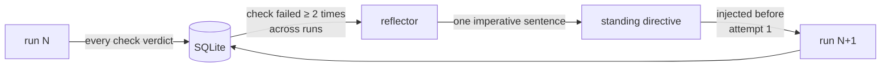

# lessonforge

**A self-evaluating lesson content generator.** It writes a beginner lesson,
judges its own work against a hard pass/fail rubric, and rewrites from the
failure reasons until the content clears the bar — or refuses to ship anything
at all.

The interesting part is not the lesson. It is that the system decides, on its
own, whether the lesson is good enough, and can prove that its judgement
discriminates.

> Built for the GenAI Engineer — Content Systems assessment.
> Topic: **Introduction to RAG (Retrieval-Augmented Generation)**.
> Target learner: a 12th-grade graduate from India, limited English vocabulary,
> non-English-medium background, starting an AI career from zero.

---

## The loop


A real run, offline, in ten seconds:

```
  plan      blueprint ready · 5 objectives, 10 concepts · analogy: open-book exam
  generate  attempt 1 · 2,079 chars · first draft
  evaluate  attempt 1 · FAIL · 6/18 checks passed · grade 21.32, 283 words
            ✗ accuracy_grounded          ✗ no_weight_update_myth
            ✗ readability_grade          ✗ sentence_length
            ✗ jargon_density             ✗ has_concrete_analogy
            ...
  generate  attempt 2 · 5,406 chars · with revision brief
  evaluate  attempt 2 · PASS · 18/18 checks passed · grade 4.67, 864 words
  gate      shipped after 2/3 attempts
  reflect   new standing directives learned: 3
```

---

## Quick start

```bash
make setup                 # venv + dependencies
make run-offline           # full loop, no API key required
make test                  # 61 tests, no API key required
```

The offline path is not a stub. It replays a genuinely bad first draft and a
genuinely good second one through the real rubric, so the retry path, the
deterministic checks, the memory writes, and the evolution step all execute for
real.

To run against a live model:

```bash
cp .env.example .env       # add your GEMINI_API_KEY
make run                   # generate → evaluate → regenerate on Gemini
```

---

## What it does that a prompt does not

| | |
|---|---|
| **Refuses to ship** | If the retry budget runs out with checks still failing, no lesson is written. Failing closed is the whole point — shipping content the system judged inadequate would make the evaluation theatre. |
| **Measures what is measurable** | Readability, sentence length, jargon density and coverage are computed in Python. No LLM is asked to count. |
| **Judges with an independent context** | The evaluator never sees the generation prompt, the plan, or the fact that this is attempt 3. It reads an anonymous document and a checklist. |
| **Demands evidence** | Every judged failure must quote the offending text verbatim. Quotes that do not appear in the lesson are rejected automatically and the failure is discarded. |
| **Proves the rubric works** | `make verify` plants six known errors in a passing lesson and checks that the predicted checks fail. A rubric nobody has tried to fool is a rubric nobody knows works. |
| **Learns across runs** | Checks that keep failing become standing directives injected into every future generation, before the first attempt. |

---

## Commands

| Command | What it does |
|---|---|
| `lessonforge run` | Generate → evaluate → regenerate. Exits non-zero if nothing shipped. |
| `lessonforge run --inject-error factual` | Plant a deliberate error and watch the evaluator catch it. |
| `lessonforge verify` | Corrupt a passing lesson six ways; report which checks caught what. |
| `lessonforge rubric` | Print all 18 checks. |
| `lessonforge memory` | What has been learned: failure patterns, directives, first-attempt pass rate. |
| `lessonforge graph` | Print the state machine. |
| `lessonforge models` | List models your API key can actually reach. |
| `lessonforge export-rubric` | Regenerate `docs/RUBRIC.md` from code. |

Every command takes `--provider mock` to run offline.

---

## Output

Each run writes a timestamped directory:

```
output/20260811-105139-introduction-to-rag/
├── lesson.md           the shippable lesson (only if it passed)
├── rejected_draft.md   the best attempt (only if it did not)
├── rejection_log.md    what failed, why, quoted evidence, what changed on retry
├── run.json            full machine-readable trace
└── drafts/
    ├── attempt_1.md
    └── attempt_2.md
```

`rejection_log.md` is the artefact that proves the loop is real. Anyone can show
a good final lesson; the log shows the system rejecting its own work, with the
quoted text that failed each check and a diff of what the retry fixed.

---

## The rubric

18 checkpoints across the six required dimensions. 16 blocking, 2 advisory. Every
one is hard pass/fail — no partial credit, no weighted score, no "mostly passes".
Full definitions in [`docs/RUBRIC.md`](docs/RUBRIC.md).

| Dimension | Checks |
|---|---|
| Accurate & grounded | `accuracy_grounded`, `no_unsupported_claims`, `no_weight_update_myth` |
| Beginner-friendly language | `readability_grade`, `sentence_length`, `no_runaway_sentence`, `no_idioms_or_cultural_refs`, `length_in_range`* |
| Teaches by example | `has_concrete_analogy`, `has_worked_example`, `example_density` |
| No unexplained jargon | `jargon_defined_on_first_use`, `jargon_density` |
| Covers the key points | `covers_what_why_how`, `covers_three_steps` |
| Coherent teaching flow | `no_forward_references`, `standalone_completeness`, `has_recap`* |

<sub>* advisory — tracked and reported, does not block shipping.</sub>

Half the checks are **deterministic Python**, half are **LLM-judged**. That split
is deliberate: an LLM is the only way to assess meaning and a poor way to assess
anything countable. Readability and jargon density are measured; coherence and
grounding are judged. See [`docs/ARCHITECTURE.md`](docs/ARCHITECTURE.md) for the
reasoning behind every design choice.

---

## Proving the evaluator works

The obvious challenge to any self-evaluating system: *your evaluator passed the
lesson, but would it have failed a bad one?*

```bash
make verify
```

Takes a lesson that passes all 16 blocking checks, corrupts it six ways, and
reports whether the checks **predicted in advance** actually fired:

```
Baseline passes every blocking check. The experiment is valid.

┏━━━━━━━━━━━━━┳━━━━━━━━━━━━━━━━━━━━━━━━━━━━━┳━━━━━━━━┳━━━━━━━━┓
┃ injection   ┃ predicted to fail           ┃ caught ┃ missed ┃
┡━━━━━━━━━━━━━╇━━━━━━━━━━━━━━━━━━━━━━━━━━━━━╇━━━━━━━━╇━━━━━━━━┩
│ factual     │ no_weight_update_myth, …    │  yes   │   —    │
│ fabrication │ no_unsupported_claims       │  yes   │   —    │
│ jargon      │ jargon_defined_on_first_us… │  yes   │   —    │
│ idiom       │ no_idioms_or_cultural_refs  │  yes   │   —    │
│ dependency  │ standalone_completeness, …  │  yes   │   —    │
│ coverage    │ has_worked_example, …       │  yes   │   —    │
└─────────────┴─────────────────────────────┴────────┴────────┘
```

Predictions are declared in `inject.py` before any result is seen, and the same
experiment runs in CI as `tests/test_injection.py`. If someone loosens a
threshold, a test fails.

**This process already found a real bug.** The `jargon` injection was originally
predicted to fail `readability_grade`. It did not: appending one 60-word
unreadable paragraph to a long clean lesson moved the Flesch-Kincaid grade from
4.67 to 5.62 — correctly inside the limit, because document-level averages are
robust to localised damage. That is the wrong property for a beginner who only
has to hit one impenetrable sentence to stop reading, so `no_runaway_sentence`
was added as an absolute per-sentence ceiling that no averaging can smooth over.

---

## Memory and self-evolution

Memory here does not mean conversation history. It answers one question across
the lifetime of the system: **which checks does the generator keep failing, and
what should we tell it up front so it stops?**



Run 1 learns nothing — one failure is noise. By run 2 a pattern has crossed the
threshold and directives appear:

```
run 1   reflect   no new directives (nothing crossed threshold)
run 2   reflect   new standing directives learned:
                  + (sentence_length) Write one idea per sentence and never
                    exceed 25 words in a single sentence.
run 3   plan      3 learned directive(s) loaded from memory
```

The claim is deliberately narrow and falsifiable: **first-attempt pass rate
should rise as directives accumulate.** `lessonforge memory` prints exactly that
number and the per-run history, so the claim can be checked rather than
believed.

Two guard rails, because a system that edits its own prompt can drift:

- Directives are capped and deduplicated, so the system prompt cannot grow
  without bound.
- **The rubric is never modified automatically.** Checks that stop
  discriminating are reported to a human for review. A loop allowed to relax its
  own passing criteria will eventually pass everything — which is precisely the
  failure this design exists to prevent.

---

## Project layout

```
src/lessonforge/
├── graph.py            the state machine — the whole loop is one conditional edge
├── state.py            what flows between nodes
├── config.py           every threshold and policy, in one auditable place
├── nodes/              plan · generate · evaluate · reflect · persist
├── rubric/
│   ├── registry.py     the 18 checks
│   ├── deterministic.py  readability, jargon, coverage — pure Python
│   ├── judge.py        LLM judge + anti-fabrication defences
│   └── schema.py       pass/fail data model (no scores anywhere, by design)
├── memory/
│   ├── store.py        SQLite: runs, verdicts, directives
│   └── evolve.py       failure patterns → standing directives
├── llm/                provider protocol · gemini · offline mock
├── prompts/            planner · generator · judge · reflector (versioned files)
├── knowledge/          the grounding source of truth
├── inject.py           deliberate error injection
└── verify.py           the evaluator's own experiment
```

---

## Requirements

- Python 3.11+
- A Gemini API key ([AI Studio](https://aistudio.google.com/apikey)) — only for
  live runs; tests and `make run-offline` need nothing.

### Troubleshooting

**`ModuleNotFoundError: No module named 'lessonforge'` after `pip install -e .`**
— some Python builds silently skip `__editable__*.pth` files, which leaves the
console script installed but the package unimportable. Every `make` target sets
`PYTHONPATH=src` and invokes `python -m lessonforge`, which works regardless. Use
`make run` rather than the bare `lessonforge` script if you hit this.

---

## Documentation

- [`docs/ARCHITECTURE.md`](docs/ARCHITECTURE.md) — every design decision and the
  reasoning behind it, including the trade-offs and the things this design gets
  wrong.
- [`docs/RUBRIC.md`](docs/RUBRIC.md) — all 18 checks in full, generated from code.
- [`docs/LOOM_SCRIPT.md`](docs/LOOM_SCRIPT.md) — the video walkthrough script.

## Licence

MIT
