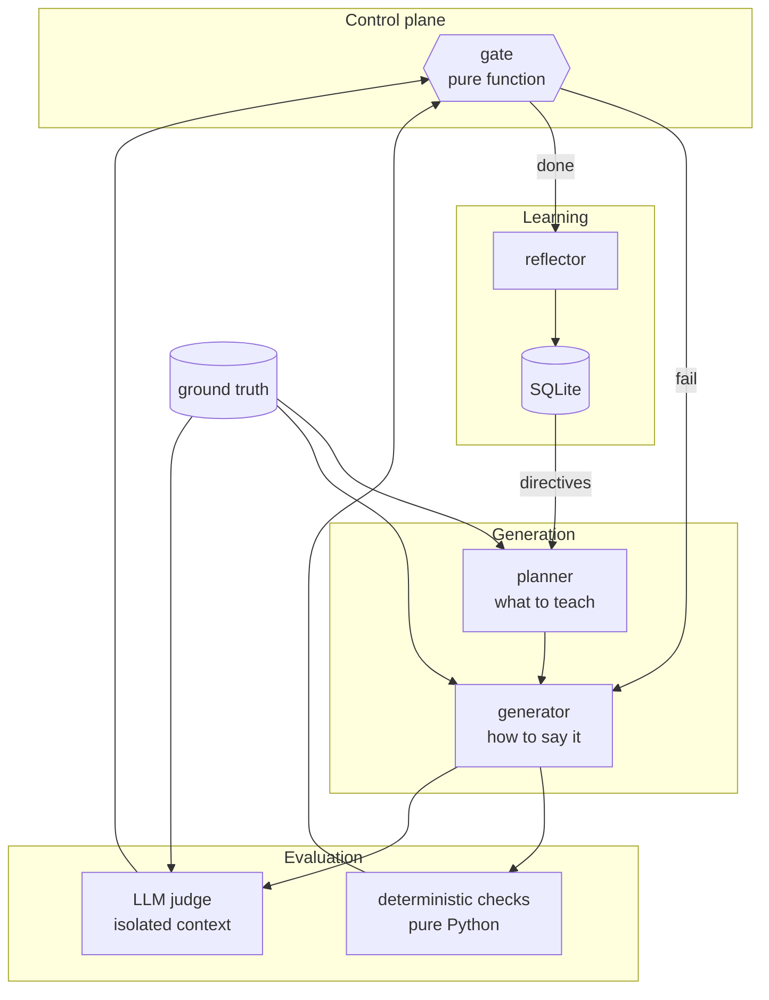

# Architecture

Why this system is shaped the way it is. Each section states a decision, the
alternative it was chosen over, and what it costs.

---

## 1. The problem, stated precisely

Generating a beginner lesson is easy. The hard problem is **deciding whether the
lesson is good enough to put in front of a learner, without a human reading it.**

That reframing drives everything below. The generator is the least interesting
component. The evaluator is the product, and the evaluator's own trustworthiness
is the thing that actually has to be engineered.

The target learner is specific, and specificity is what makes the rubric
possible: a 12th-grade graduate from India, limited English vocabulary,
non-English-medium schooling, no Western cultural context, starting from zero.
"Is this beginner-friendly?" is unanswerable. "Would *this reader* be stopped by
this sentence?" is answerable, and several checks fall straight out of it —
idiom detection, an absolute sentence-length ceiling, jargon-on-first-use.

---

## 2. Component structure

Five LLM roles, each with one job and its own prompt file under
`src/lessonforge/prompts/`. Prompts are files, not string literals, because they
are the highest-churn part of the system and belong in diffs.

---

## 3. Planner separate from generator

**Decision.** Two calls: one decides *what to teach and in what order*, one
decides *how to word it*.

**Over.** A single "write me a lesson about X" call.

**Why.** A retry is a targeted repair, not a re-roll. When a lesson fails on
sentence length, the curriculum was fine — re-deriving it wastes tokens and
risks losing a concept ordering that was already correct. Splitting the roles
means the revision brief goes to the layer that actually failed.

It also makes the concept ordering an explicit, inspectable artefact
(`plan.concept_order`), which is what `no_forward_references` is checking
against. A dependency order you can read is a dependency order you can test.

**Cost.** One extra API call per run. Bought with the cheaper model
(`gemini-2.5-flash`), since planning is structurally constrained by a schema.

---

## 4. The rubric is hard pass/fail, with no scores anywhere

**Decision.** Every check returns `PASS` or `FAIL`. The overall verdict is a
plain `AND` across blocking checks. There is no numeric score in the data model
at all — `tests/test_rubric_and_judge.py` asserts that no field named `score`,
`rating`, `confidence`, or `weight` exists.

**Over.** A 0–10 score per dimension with a passing threshold.

**Why.** A score invites a threshold argument — *is 7.5 good enough?* — and the
argument never resolves, because the number was never grounded in anything. Worse,
scores let a model hedge: an evaluator that can say "7/10" will say "7/10"
instead of committing. A boolean forces a decision and makes the failure
actionable, because the only way to justify `FAIL` is to say what is wrong.

Averaging also hides exactly the failures that matter most. A lesson that is
excellent on five dimensions and factually wrong on the sixth scores well and
must never ship.

**Cost.** Coarser signal. A lesson that fails one check by a hair looks identical
to one that fails catastrophically. Mitigated by the reason and evidence fields,
which carry the nuance the boolean discards.

---

## 5. Half the rubric never calls an LLM

**Decision.** Readability, sentence length, jargon density, example signposting,
pipeline-term coverage, and word count are computed in Python. Grounding,
coherence, analogy quality, and jargon-in-context are judged by a model.

**Over.** Asking the LLM to assess everything.

**Why.** LLMs cannot reliably count, and every measurable property here is a
counting problem. Measuring instead of asking buys three things:

- **Reproducibility.** Same draft, same verdict, forever. A rubric that returns
  different answers on identical input is not a rubric.
- **Cost.** These run in microseconds and catch the most common failures before
  a single judge token is spent.
- **Non-negotiability.** The generator cannot talk a regex out of its verdict.
  Model-judged checks are, ultimately, persuadable.

Flesch-Kincaid and syllable counting are implemented from scratch rather than
pulled from `textstat`, so the numbers are auditable and the package has no
surprise dependency.

**Cost.** Deterministic checks are literal-minded. `jargon_density` uses a
curated term list with a proximity window for definitions, so it can miss a term
nobody thought of and can be satisfied by a definition that is nearby but bad.
The judged `jargon_defined_on_first_use` check exists to cover that gap — the two
engines overlap on purpose.

---

## 6. Judge independence

**Decision.** The judge call is built from exactly three inputs: the lesson, the
ground truth, and the check list. It never sees the generator's system prompt,
the plan, the previous failure feedback, or the attempt number.

**Over.** Passing the full context so the judge "understands the intent".

**Why.** A model shown *here is what you were asked to write, and here is what
you wrote* grades its own homework, and grades it kindly. Removing the authorship
cue removes the bias. The judge reads an anonymous document, exactly as a learner
would.

Attempt number is withheld for the same reason: an evaluator that knows this is
the last attempt has a reason to be lenient. It must not know the stakes.

**Cost.** The judge sometimes flags something the plan deliberately deferred, and
cannot tell "wrong" from "intentionally simplified". This is the correct trade —
a learner cannot tell those apart either.

---

## 7. Three defences against a judge that lies

An LLM judge is itself an unreliable narrator. Three mechanisms, all tested:

**Structured output.** The judge is bound to a Pydantic schema, so it cannot
answer a checklist with an essay.

**Evidence quotes.** Every failure must carry a verbatim quote from the lesson.
`_evidence_is_real()` checks the quote actually appears — exact match first, then
a sliding fuzzy match, because models re-wrap whitespace when quoting and
reformatting is not fabrication. **A failure justified by a quote that is not in
the lesson is discarded and the check passes**, with the discrepancy recorded.
The judge cannot invent a violation it cannot cite.

**Silence is not a pass.** A check the judge fails to return is recorded as a
*failure*, never a pass. An evaluator that can make a check disappear by omitting
it would be trivially gameable.

Related: `blocking` and `kind` are stripped from the judge's output schema
entirely. Whether a check blocks shipping is a fact about the rubric, not an
opinion the judge is entitled to — those fields are filled from the registry
after the call, so a judge cannot downgrade a blocking check to advisory to let
a lesson through.

---

## 8. Failing closed

**Decision.** If the retry budget is exhausted with blocking checks still
failing, **no lesson is written.** The best attempt is saved as
`rejected_draft.md` and the process exits non-zero.

**Over.** Shipping the best available attempt with a warning.

**Why.** The entire value of this system is the decision "is this good enough".
Shipping content the system just judged inadequate makes the evaluation theatre.
A non-zero exit means a pipeline stops rather than publishing.

**Cost.** A run can produce nothing. That is the intended behaviour, not a
failure mode.

---

## 9. LangGraph rather than a while loop

**Decision.** The loop is a compiled `StateGraph`.

**Over.** A `while attempt < max_retries` loop, which would be perhaps 30 lines
less code.

**Why.** The control flow genuinely is a state machine with a conditional cycle,
and three things follow from making that explicit:

- The termination condition is one named, **pure** function (`gate`) with no I/O,
  unit-tested in isolation across six cases. In a while loop it would be spread
  across the loop condition and a couple of breaks.
- Accumulated state (every draft, every evaluation) is declared in the state
  schema with explicit reducers. This is what makes the rejection log a
  *projection of real data* rather than a side-list maintained in parallel and
  hoped to be accurate.
- Streaming, checkpointing, and topology inspection come free.

**Cost.** A dependency and some ceremony for a loop that runs at most three
times. Honest assessment: at this size the while loop would work. The structure
earns its place when the graph grows a human-review branch or parallel judges —
and the pure `gate` function is a real testability win today.

**Termination is guaranteed twice.** The gate refuses to loop past
`max_retries`, and `hard_cap_attempts` is an independent ceiling that holds even
if the policy is misconfigured. `test_gate_respects_hard_cap_even_if_max_retries_is_absurd`
sets `max_retries=9999` and asserts the loop still stops.

---

## 10. Feedback is a structured brief, not a complaint

The revision brief contains, per failed check: the check id, why it failed, the
**quoted offending text**, and the required fix — plus an instruction to preserve
everything not flagged.

Passing checks are deliberately omitted. Listing them invites the model to
rewrite things that were already fine and regress them.

"Make it simpler" produces a differently-bad lesson. "The sentence beginning
'The system utilises dense vector embeddings' is 44 words and uses four undefined
terms" produces a fix.

---

## 11. Memory is relational, not vector

**Decision.** SQLite. Tables for runs, per-check verdicts, learned directives,
and lessons.

**Over.** A vector store, the reflexive choice for anything called "memory".

**Why.** This data is small, relational, and queried by exact key: *how many
times has `sentence_length` failed?* Similarity search answers a question nobody
is asking. Choosing a vector database here would be résumé-driven design.

**What memory is for.** Not conversation history. One question across the
lifetime of the system: which checks does the generator keep failing, and what
should we tell it up front so it stops?

---

## 12. Self-evolution, and its guard rails

**Decision.** After each run, checks that have failed `patch_threshold` times
(default 2) across the store become candidates. A reflector writes one imperative
sentence per candidate, stored as a standing directive and injected into the
generator's system prompt on **every subsequent run, before the first attempt**.

**Why a threshold.** One failure is noise. Patching on a single failure overfits
the prompt to one unlucky run.

**The falsifiable claim.** First-attempt pass rate should rise as directives
accumulate. `lessonforge memory` prints that number and the per-run history. If
it does not move, this layer is decoration — and the store is what proves it
either way. Stating the metric up front is the difference between a feature and
a claim.

**Guard rails.**

- Directives are capped (`max_active_patches`, default 8) and deduplicated on
  exact text, so the system prompt cannot grow without bound.
- The reflector may only patch checks it was explicitly asked about. A proposal
  for any other check is dropped — tested in
  `test_reflector_cannot_patch_a_check_it_was_not_asked_about`.
- The reflector prompt forbids proposing that a check be relaxed. It tightens the
  generator; it never lowers the bar.
- **The rubric is never modified automatically.** Checks that stop discriminating
  are reported for human review. A loop permitted to relax its own passing
  criteria converges on passing everything, which is the exact failure this
  system exists to prevent.
- Reflection failure is caught and never fails a run that already produced a
  shippable lesson. Evolution is an optimisation, not a dependency.

**Cost.** Directives are model-written text going into a prompt unreviewed. The
cap, the check-id whitelist, and the no-loosening instruction bound the blast
radius, but a human should read `lessonforge memory` periodically. This is the
part of the system that most needs supervision, and saying so is part of the
design.

---

## 13. Grounding

`knowledge/rag_ground_truth.md` is a short, deliberately boring file of numbered
facts plus an explicit **forbidden claims** list. The judge checks every factual
assertion against it.

The forbidden-claims list encodes the misconceptions this topic reliably
produces — chiefly *"RAG retrains the model"*, which is both the most common
beginner error and the most damaging, since it leads to a wrong mental model of
everything downstream. It gets its own dedicated check (`no_weight_update_myth`)
rather than relying on general accuracy.

**Cost.** The system can only teach what the ground truth contains. That is a
feature for a lesson generator with a fixed syllabus and a limitation for
open-ended topics. Extending to new topics means writing a new ground-truth file
— which is the honest amount of work, not a gap in the design.

---

## 14. Verifying the evaluator

The hard question about any self-evaluating system: *how do you know the
evaluator would have failed a bad lesson?*

`lessonforge verify` runs a controlled experiment:

1. Confirm a baseline lesson passes every blocking check. **If it does not, the
   experiment is void and reported as inconclusive** — you cannot show a check
   catching a planted error if it was already failing.
2. Corrupt a copy in one known way.
3. Compare against checks **predicted in advance**, declared in `inject.py`
   before any result is seen.
4. Report caught, missed, and collateral failures.

Six injection modes: `factual`, `fabrication`, `jargon`, `idiom`, `dependency`,
`coverage`. The same experiment runs in CI, so loosening a threshold breaks a
test.

**This found a real bug, which is the point.** The `jargon` injection was
originally predicted to fail `readability_grade` and `sentence_length`. It did
not. Appending one 60-word unreadable paragraph to a long clean lesson moved the
grade from 4.67 to 5.62 and the average sentence from 8.91 to 9.42 words — both
comfortably inside their limits.

The checks were right; **the prediction was wrong.** Document-level averages are
*supposed* to be robust to one bad paragraph. But that robustness is the wrong
property for this reader, who only has to hit one impenetrable sentence to stop
reading. So `no_runaway_sentence` was added: an absolute per-sentence ceiling
that no averaging can smooth over, with a test
(`test_runaway_sentence_caught_even_when_averages_are_fine`) constructing exactly
the case where every average passes and the check still fires.

A rubric nobody has tried to fool is a rubric nobody knows works.

---

## 15. Offline provider

`MockProvider` replays a scripted bad first draft and a good second one through
the **real** rubric. The retry path, deterministic checks, memory writes, and
evolution step all execute for real. Tests and CI need no API key.

This is also a correctness tool: the bundled good draft is a golden fixture that
must pass every deterministic check, so a threshold change that makes the rubric
unclearable fails a test immediately.

**Limitation, stated plainly.** The mock's judged checks are keyword sentinels,
not semantic understanding. `verify --provider mock` genuinely tests the
deterministic half and only approximates the judged half. **The real
verification is `verify --provider gemini`.** Building the mock surfaced this
directly: an early version scanned the whole judge prompt rather than just the
lesson, so checks whose questions quote the phrases they forbid ("as we will see
later") failed themselves on every lesson.

---

## 16. What this design gets wrong

Stated plainly, because a design document that only lists strengths is marketing.

- **A single judge model.** Two judges from different families with disagreement
  escalation would be more robust. One judge is a single point of failure with
  its own blind spots, and a judged check can only be as good as the model
  behind it.
- **The jargon list is curated by hand.** It covers the terms this topic
  produces. A new topic needs new terms, and nothing warns you when the list is
  stale.
- **Thresholds are asserted, not derived.** Flesch-Kincaid ≤ 9.0 and 45 words are
  defensible for this audience but were not validated against real learners.
  Doing that properly means testing comprehension with actual readers.
- **Retry cost is not bounded in tokens.** The loop bounds attempts, not spend. A
  pathological lesson can burn three full generate-plus-judge cycles.
- **Directives accumulate but are never retired.** A directive that stops being
  useful stays in the prompt until a human deactivates it. The store supports
  deactivation; nothing calls it automatically, because automatic removal has the
  same drift risk as automatic rubric edits.
- **`verify` proves the rubric catches *these six* errors.** It does not prove
  the rubric is complete. Nothing could.

---

## 17. Extension points

| Want to | Do this |
|---|---|
| Add a check | Append a `CheckSpec` to `rubric/registry.py`. Deterministic checks get a branch in `deterministic.py`; judged ones are picked up automatically. |
| Change a threshold | `config.py`. Every tunable is in one place so the loop's behaviour can be audited from one file. |
| Swap the model provider | Implement `LLMProvider` (two methods) and register it in `llm/__init__.py`. The graph imports no vendor SDK. |
| Teach a new topic | Write a new ground-truth file and point `Settings.ground_truth()` at it. |
| Add a human review gate | Add a node between `finalise` and `persist` and one conditional edge. |
